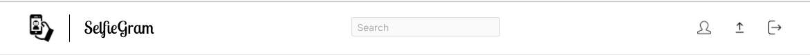
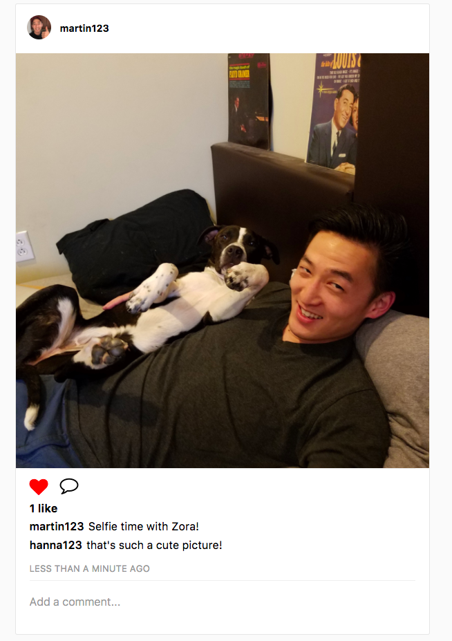
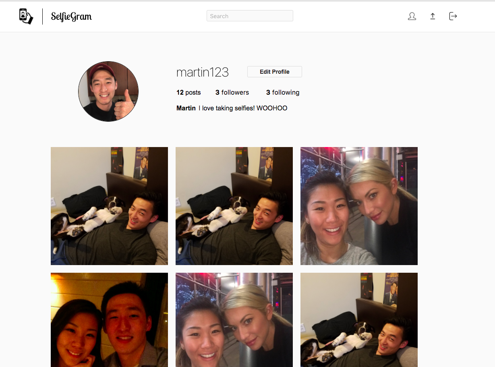
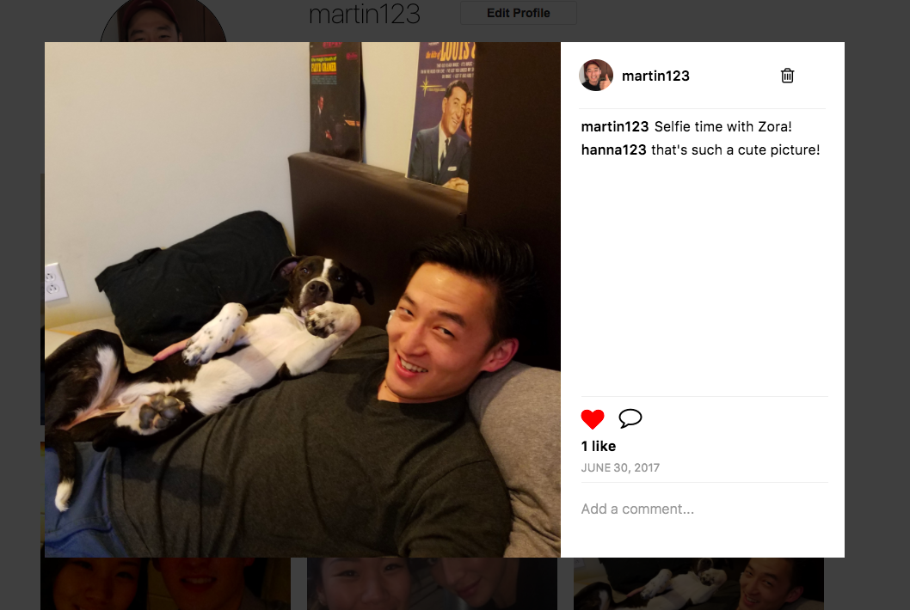
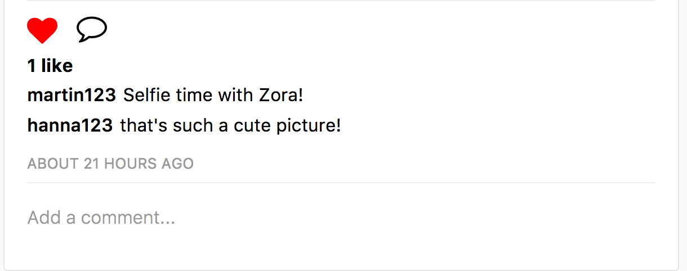
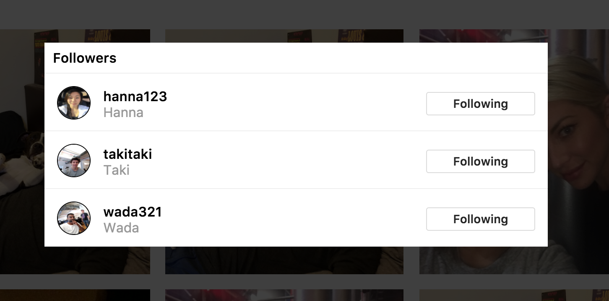
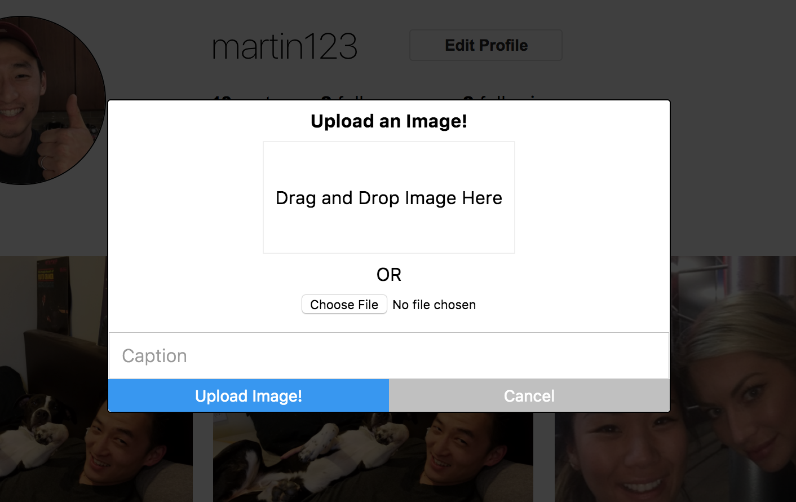
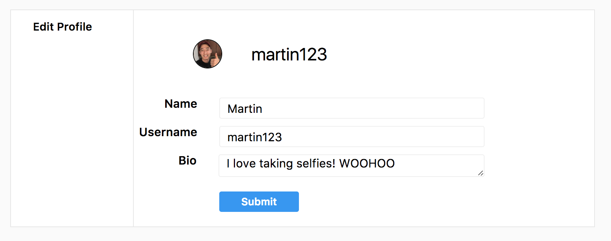
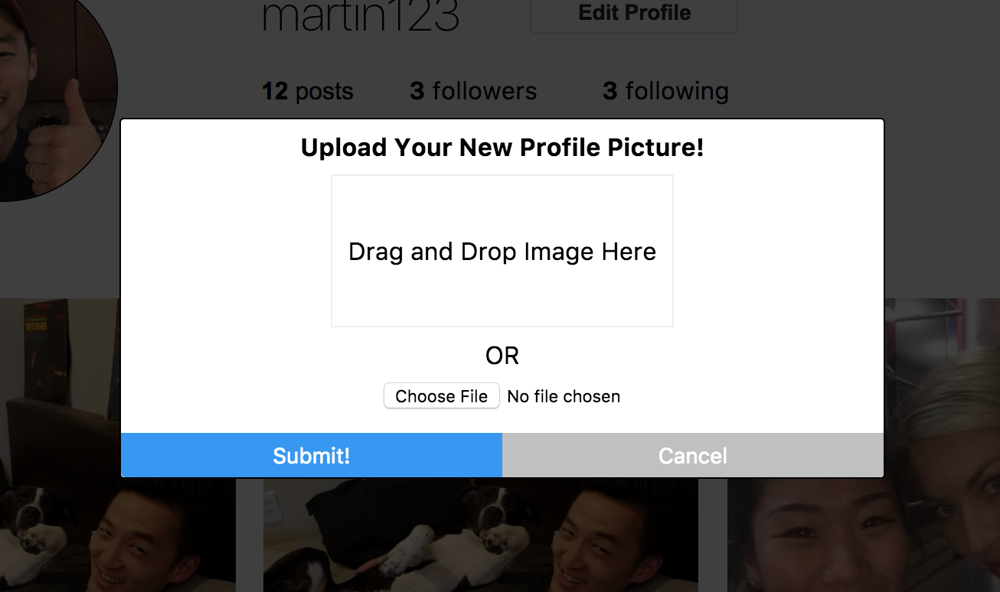

# SelfieGram

[SelfieGram][heroku]

[heroku]: https://selfiegram-app.herokuapp.com

SelfieGram is a web application that took inspiration from Instagram.  The site is designed for everyone who uses any form of social media.. because lets be honest, who doesn't enjoy taking selfies?  Users can post selfies and share their photos with their friends!  The full-stack was developed using Ruby on Rails on the backend and React/Redux on the frontend.

## Features

### User Authentication

Users can sign up and log in.  The authentication process uses BCrypt to hash the passwords and ensures user privacy.

### Header

Gives the user the ability to navigate through the site.  The logo on the top-left will navigate the user to the photo feed page.  The buttons on the right will navigate the user to the user profile page, photo upload modal, and logout, respectively.  The search bar will be implemented in the soon future.

### Photo Feed

Photos of the user and their followers will be displayed here.  Images are uploaded and download using AWS (Amazon Web Services).  The photos are sorted on the photo feed page based on the created_at timestamp.  User can like the photo by clicking the heart icon or by double clicking the image itself.  The uploader's username and profile picture will link the current user to the uploader's user page.

### Users Profile Page

This is the user's profile page which will display all of the user's uploaded photos.  On this page the user can upload photos, edit profile, edit profile pictures, see the user's followers and followees, etc.

### Photo Detail

The photo detail view opens up in a modal which provides the user with a larger 600x600 view of the image.  The modal provides the user the ability to leave a comment, delete their own comments, like or unlike a photo, and delete their own uploaded photos.

### Likes and Comments

Photos on the photo feed along with photos displayed in the photo detail modal allows the user to add or delete comments or to like or unlike the photo.

### Follows

Users can choose other accounts to follow.  Once a user follows another account, the account's photos will be included in the user's photo feed sorted by creation time.  Below is a followers modal that is opened when follower or following is clicked on a user profile.  Directly inside of the modal a user can choose to follow or unfollow a particular account.

### Upload Photo

Users can upload photos directly from this modal.  This upload form provides users 2 choices to upload photos.  The user can either click the choose file button and navigate to the image, or they can drag and drop the image directly into the upload photo modal.  There is also a place where the user can write a caption for the photo.

### Edit Profile and Avatar

The user can also change their avatar by clicking their profile picture on the user show page.  The form is very similar to the photo upload form.  When a user visits another user's show page, next to the user's username, there will be a follows button.  When a user is on their own show page, then the follow button is replaced with a edit profile button which navigates the user to another page where they can edit their name, username, or bio.

## Technologies
### Backend

[Ruby on Rails](http://rubyonrails.org/) was utilized on the backend to build this app with a [PostgreSQL](https://www.postgresql.org/) database system to store and retrieve data.  

- BCrypt library to hash password to ensure user privacy.
- Prevent CSRF (Cross-site request forgery) attack.
- AWS (Amazon Web Services) and paperclip was used to store photos on S3 storage to speed up page load times and to prevent storing all the photos inside the project files themselves.
- Figaro was used to protect API keys.
- RESTful routes was used to generate JSON responses.
- Hosted on Heroku.

### Frontend

[React](https://facebook.github.io/react/)/[Redux](http://redux.js.org) are frontend JavaScript libraries that enable developers create a single-page App.  The two libraries is used for quick re-rendering whenever there is a change to state.  This is done through an algorithm that checks for differences between the DOM and React's virtual DOM.

- NPM (Node Package Manager) manages dependencies.
- Webpack used to bundle all files.
- Babel to compile S files for compatible code.
- SCSS and CSS was used to create the front end design for this app.

## Additional Resources

- [View Wireframes](https://github.com/mwchung24/instagramClone/tree/master/docs/wireframes)
- [React Components](component-hierarchy.md)
- [API Endpoints](api-endpoints.md)
- [DB Schema](schema.md)
- [Sample State](sample-state.md)

## Future Improvements

SelfieGram was designed and built in 10 days and the list below are feature I would like to implement in the future.

### Search

Allow users to search by username or hashtags.

### Infinite Scroll

The app was initially load with 10 photos on the photo feed page and 6 photos on the user show page.  Then when the user scrolls to the bottom of the page more photos will be fetched and rendered.

### Direct Messaging

Give users access to message followers and followees directly and privately through live messaging.

### Hash Tags

Allow users to tag photos with hashtags allowing the hash tags to be searched in the search bar.

### Collapsable Comments

When the number of comments get over 3 comments, the comments would collapse and display the latest 3 comments.  The collapsed section of the comments will have a count of the total number of comments.  More comments can be viewed by clicking the collapsed section.

### Videos

Allow users to upload not only photos but also videos.
