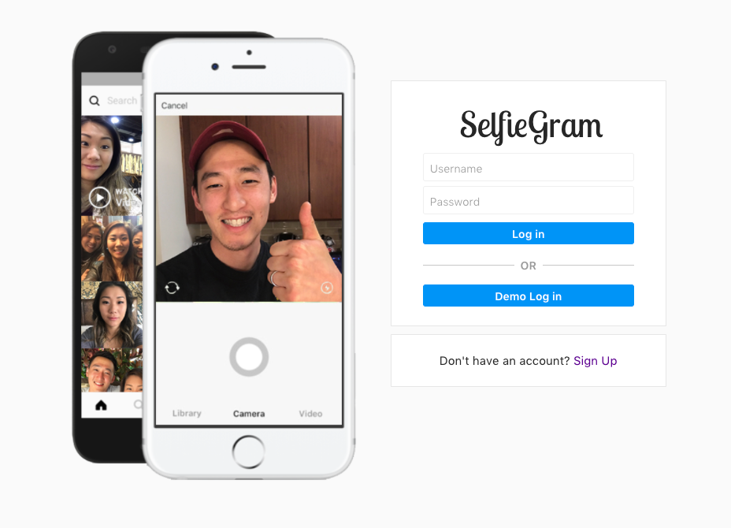

# SelfieGram

[SelfieGram][heroku]

[heroku]: https://selfiegram-app.herokuapp.com

SelfieGram is a web application that took inspiration from Instagram.  The site is designed for everyone who uses any form of social media.. because lets be honest, who doesn't enjoy taking selfies?  Users can post selfies and share their photos with their friends!  The full-stack was developed using Ruby on Rails on the backend and React/Redux on the frontend.

## Features

### User Authentication

Users can sign up and log in.  The authentication process uses BCrypt to hash the passwords and ensures user privacy.

### Header

Give the user the ability to navigate through the site.  The logo on the top-left will navigate the user to the photo feed page.  The buttons on the right are buttons that navigate to user profile, photo upload, and logout, respectively.  The search bar will be implemented in the soon future.

### Photo Feed

Photos of the user and their followers will be displayed here.  Images are uploaded and download using AWS (Amazon Web Services).  The photos are sorted on the photo feed page based on the created_at timestamp.  User can like the photo by clicking the heart icon or by double clicking the image itself.  The uploader's username and profile picture will link the current user to the uploader's user page.

### Users Profile Page

This is the user's profile page which will display all of the user's uploaded photos.  On this page the user can upload photos, edit profile, edit profile pictures, see the user's followers and followees, etc.

## Additional Resources

- [View Wireframes](https://github.com/mwchung24/instagramClone/tree/master/docs/wireframes)
- [React Components](component-hierarchy.md)
- [API Endpoints](api-endpoints.md)
- [DB Schema](schema.md)
- [Sample State](sample-state.md)

## Future Improvements

SelfieGram was designed and built in 10 days and the list below are feature I would like to implement in the future.

### Search

Allow users to search by username or hashtags.

### Infinite Scroll

The app was initially load with 10 photos on the photo feed page and 6 photos on the user show page.  Then when the user scrolls to the bottom of the page more photos will be fetched and rendered.

### Direct Messaging

Give users access to message followers and followees directly and privately through live messaging.

### Hash Tags

Allow users to tag photos with hashtags allowing the hash tags to be searched in the search bar.

### Collapsable Comments

When the number of comments get over 3 comments, the comments would collapse and display the latest 3 comments.  The collapsed section of the comments will have a count of the total number of comments.  More comments can be viewed by clicking the collapsed section.

### Videos

Allow users to upload not only photos but also videos.
